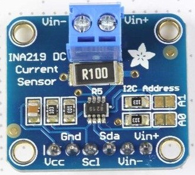

INA219
=================

Python files to read the values from the INA219 sensor on the Beaglebone Black

Dependencys :
	sudo apt install python-smbus

| Board pin name | Board pin |  Beaglebone Black pin name   |
|----------------|-----------|------------------------------|
| VCC            | 1         | P9\_12, GPIO                 |
| GND            | 2         | P9\_23, GPIO                 |
| Scl            | 3         | P9\_19, I2C2\_SCL            |
| Sda            | 4         | P9\_20, I2C_SDA              |
| Vin-           | 5         | positive power out to device |
| Vin+           | 6         | positive power in from souce |

